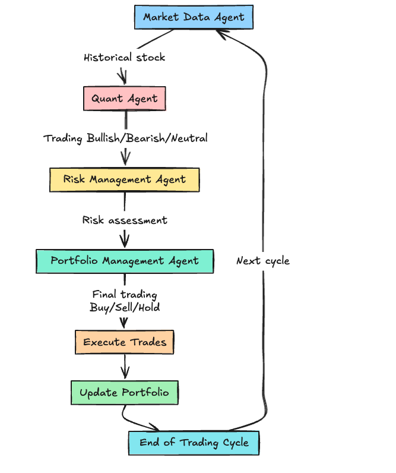

# Hedge Fund Trading Workflow with AI Agents
This repository implements an AI-driven trading workflow that simulates a hedge fund's decision-making process. The system uses a sequence of specialized agents to analyze market data, generate trading signals, evaluate portfolio risks, and make final trading decisions. Built with LangChain, OpenAI's GPT-4, and Python, this system provides a structured and scalable framework for automated trading strategies.

## Architecture

Below is the architecture diagram for the project:



# Features
Market Data Analysis:

Fetches historical price data.
Calculates technical indicators like moving averages (SMA-5, SMA-20).
Quantitative Signal Generation:

Generates trading signals (bullish, bearish, neutral) using GPT-4.
Risk Management:

Evaluates portfolio exposure.
Recommends position sizing (max_position_size) and risk score.
Portfolio Management:

Makes trading decisions (buy, sell, or hold) based on portfolio constraints and risk assessments.
Backtesting Framework:

Simulates trading performance over a historical date range.
Calculates metrics such as total return, Sharpe ratio, and maximum drawdown.

# Technologies Used


LangChain: For building agent workflows.
OpenAI GPT-4: For intelligent analysis and decision-making.
Python Libraries:
pandas: For data handling.
matplotlib: For performance visualization.
datetime: For managing date ranges.
requests: For API calls to fetch market data.

# Workflow Architecture

Agents in the Workflow
Market Data Agent:

Gathers historical data and calculates technical indicators.
Quant Agent:

Analyzes the technical indicators to generate trading signals.
Risk Management Agent:

Evaluates portfolio risk and provides recommendations for position sizing.
Portfolio Management Agent:

Makes final trading decisions, ensuring they align with portfolio constraints.

# Execution Flow

Input:

Stock ticker, date range, and portfolio state (cash and stock holdings).
Workflow:

Market Data Agent → Quant Agent → Risk Management Agent → Portfolio Management Agent.
Output:

Final trading decision (action: buy, sell, or hold; quantity: number of shares).

# Setup

## Requirements
- Python 3.8 or higher
- Virtual Environment
- API keys:
  - OpenAI API Key
  - Financial Data API Key (e.g., from [FinancialDatasets.ai](https://financialdatasets.ai/))

## Installation

### Step 1: Clone the Repository
```bash
git clone https://github.com/your-username/hedge-fund-ai-workflow.git
cd hedge-fund-ai-workflow

Step 2: Create a Virtual Environment
python -m venv venv
source venv/bin/activate  # On Windows: venv\Scripts\activate

Step 3: Install Dependencies
Install Dependencies
pip install -r requirements.txt

Step 4: Set Environment Variables
bash
export OPENAI_API_KEY="your_openai_api_key"
export FINANCIAL_DATASETS_API_KEY="your_financial_data_api_key"

